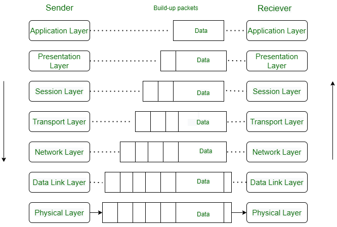

# [Layers of OSI Model](https://www.geeksforgeeks.org/layers-of-osi-model/)

1. **What does "OSI" stand for?**
   > "OSI stands for Open Systems Interconnection." - GeeksforGeeks

2. **List the 7 layers of the OSI model and what each one is responsible for.**
   > "The OSI model consists of seven abstraction layers: Physical Layer, Data Link Layer, Network Layer, Transport Layer, Session Layer, Presentation Layer, Application Layer." - GeeksforGeeks

3. **Distinguish which layers are the "hardware layers" and which layers are the "software layers." What does that even mean?**
   > "Network Layer, Data Link Layer, and Physical Layer are also known as Lower Layers or Hardware Layers... All the below 3 layers (including Session Layer) are integrated as a single layer in the TCP/IP model as the Application Layer”. These are also known as Upper Layers or Software Layers." - GeeksforGeeks

4. **How can the OSI model be used in troubleshooting?**
   >  Typically, it's used to identify at what level of networking the issue may be occurring, starting from physical connections up to application-level interactions.

# [What Is Wireshark and How Is It Used?](https://www.comptia.org/content/articles/what-is-wireshark-and-how-to-use-it)

1. **What is Wireshark?**
   > "Wireshark is a network protocol analyzer, or an application that captures packets from a network connection... Wireshark is the most often-used packet sniffer in the world." - CompTIA

2. **What is a packet?**
   > "Packet is the name given to a discrete unit of data in a typical Ethernet network." - CompTIA

3. **What are 3 high-level things does Wireshark accomplish? How could these be used for nefarious purposes? For benevolent purposes?**
   > Wireshark accomplishes packet capture, filtering, and visualization... "Cybersecurity professionals often use Wireshark to trace connections, view the contents of suspect network transactions, and identify bursts of network traffic." It can be used nefariously to intercept and analyze data for malicious purposes and benevolently for troubleshooting and securing networks. - CompTIA
