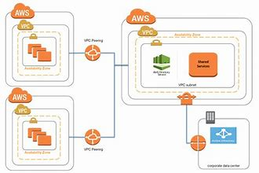

# [How can services within a VPC be made public?](https://www.cloudflare.com/learning/cloud/what-is-a-virtual-private-cloud/)

1. **How can one host within a VPC any services that need to be public?**

"With NAT, a public-facing website or application could run in a VPC."

2. **What are examples of services that would live in the publicly-accessible part of the VPC? The privately-accessible part?**

In a Virtual Private Cloud (VPC), services are typically split between public and private subnets based on their access requirements and exposure level to the internet. Here are examples for both:

  **Publicly-Accessible Part of the VPC:**
>1. **Web Servers**: Hosting websites or web applications that need to be accessible by users from the internet.
>2. **Load Balancers**: Distributing internet traffic to web servers across multiple instances to balance the load.
>3. **VPN Gateway**: Providing a connection point for a VPN so that users can securely access the VPC from the internet.
>4. **Content Delivery Network (CDN) Nodes**: Caching content closer to users for faster delivery; these are often connected to the public subnet for accessibility.
>5. **Bastion Hosts (Jump Boxes)**: Secure instances through which admins connect to manage other instances in private subnets.

**Privately-Accessible Part of the VPC:**
>1. **Database Servers**: Hosting sensitive data that should not be directly accessible from the public internet.
>2. **Application Servers**: Running business logic and processing data, these servers communicate with the database and web servers but do not serve content directly to the internet.
>3. **Caching Servers**: Such as Redis or Memcached, which are used by application servers to improve performance.
>4. **Internal Corporate Services**: Such as intranet sites, collaboration tools, or any internal management

3. **What are the trade-offs of using a VPC vs traditional infrastructure?**

 "Scalability: Because a VPC is hosted by a public cloud provider, customers can add more computing resources on demand. Easy hybrid cloud deployment: It's relatively simple to connect a VPC to a public cloud or to on-premises infrastructure via the VPN. Better performance: Cloud-hosted websites and applications typically perform better than those hosted on local on-premises servers. Better security: The public cloud providers that offer VPCs often have more resources for updating and maintaining the infrastructure, especially for small and mid-market businesses."

### Resources

- Article
- ChatGpt 