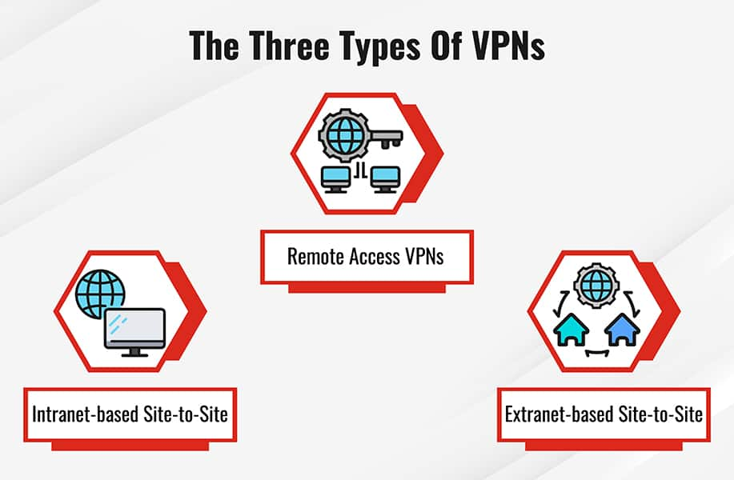

# [What Is A Site-to-Site VPN?](https://www.fortinet.com/fr/resources/cyberglossary/what-is-site-to-site-vpn)

1. **What is a site-to-site VPN?**
   > "A site-to-site virtual private network (VPN) refers to a connection set up between multiple networks... particularly helpful for organizations with more than one office spread out over large geographical locations." - Fortinet

2. **What is TCP/IP and what is it used for?**
   > "TCP/IP outlines how data is organized according to packets, given addresses, transmitted, and received across different computers on the internet." - Fortinet

3. **What are some popular reasons for using a VPN?**
   > "VPNs are useful for companies that prioritize private, protected traffic... for example, accessing resources housed on a primary network, which could include servers that facilitate email or store data." - Fortinet

4. **Explain the difference between the three types of VPNs.**
   > The content provided outlines the differences primarily between site-to-site VPNs, remote access VPNs, and other types such as MPLS and intranet or extranet-based VPNs, each serving different organizational needs. - Fortinet
