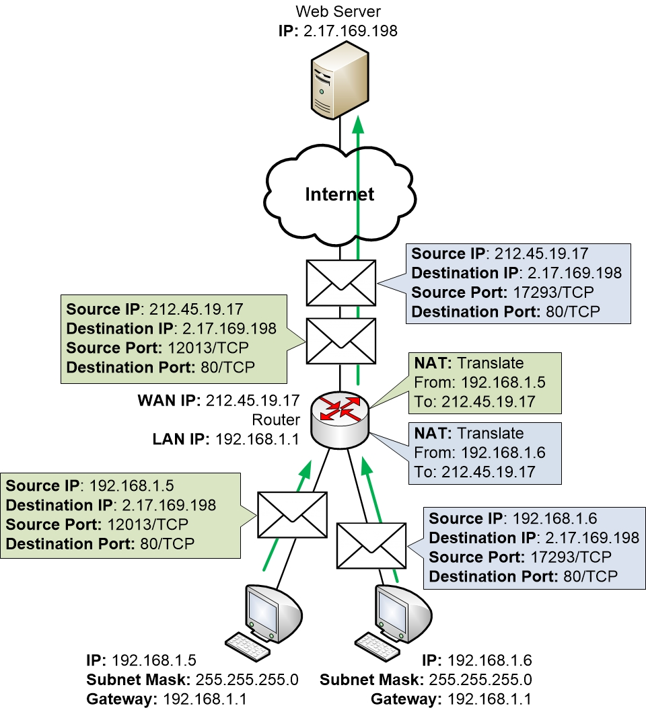

I apologize for the misunderstanding. Here's the response with direct quotes from the information you provided:

# Network Address Translation (NAT)

1. **What is the main purpose for implementing NAT on a network?**
   "Network Address Translation (NAT) is a process in which one or more local IP address is translated into one or more Global IP address and vice versa in order to provide Internet access to the local hosts."

2. **At what layer of the OSI model does NAT happen?**
   NAT operates on a "router or firewall," which are typically associated with the network layer of the OSI model. However, it should be noted that NAT involves some functions related to the transport layer, such as the translation of port numbers.

3. **What happens to packets when NAT runs out of addresses in the pool of available IPs?**
   "If NAT runs out of addresses, i.e., no address is left in the pool configured then the packets will be dropped and an Internet Control Message Protocol (ICMP) host unreachable packet to the destination is sent."

4. **What disadvantage does using NAT pose for routers?**
   "Disadvantage of NAT – Translation results in switching path delays. Certain applications will not function while NAT is enabled. Complicates tunneling protocols such as IPsec. Also, the router being a network layer device, should not tamper with port numbers(transport layer) but it has to do so because of NAT."
