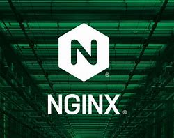

# **[What is NGINX](https://www.nginx.com/resources/glossary/nginx/)**

## 1.   What are some common use cases for NGINX?

- **Web Serving**- *The process of delivering web content, such as HTML pages, images, and scripts, to users via the internet using a web server.*
- **Reverse Proxying**-*A server configuration where the proxy server retrieves resources on behalf of a client from one or more servers, appearing to the client as if the proxy is the origin server.*
- **Caching**-*Temporarily storing copies of files or data in a cache to speed up retrieval and reduce the load on the server or network when the same content is requested again.*
- **Load Balacing**-*Distributing network or application traffic across multiple servers to ensure no single server becomes overwhelmed, thus improving responsiveness and availability.*
- **Media streaming**
- **Proxy Server** (for email)-*A server that acts as an intermediary between a user's device and the internet, handling requests for resources (like web pages or files) on behalf of the user, often used for privacy, security, or performance purposes.*
## 2. How does NGINX handle tasks that could slow down the web server?
*NGINX handles tasks that could slow down the web server by acting as an intermediary that efficiently manages resource-intensive tasks like SSL/TLS negotiation or compressing and caching content to improve performance. By doing so, it offloads these tasks from the web server, allowing it to handle more connections and serve content faster.*
## 3. Describe, as if to a non-technical friend how to actually pronounce “NGINX”, and why an org might chooose to use it.
"Engine-X." An organization might choose to use NGINX because "it is a powerful, open-source software capable of handling many web tasks such as web serving, reverse proxying, and load balancing. It is designed to efficiently manage a high volume of connections, making it ideal for high-performance contexts like busy websites or modern web applications."