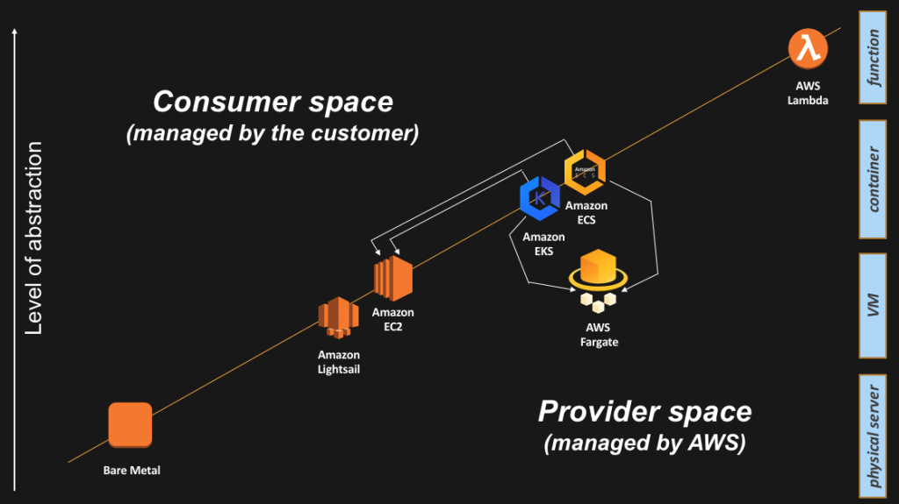

# Readings: Cloud Security Principles and Frameworks

## 1. Explain the levels of abstraction in AWS to someone without a technical background.
Basically the servers are kindve like a drag racing car, the less weight, and the less bulky it is the better it performs , and the less friction / drag is imposed on the vehicle. , so these virtual severs perform better than physical servers, and the containers perform better than the virtual servers, and the next level which is lambda where youi get the function without the spinup, its a step above the container 

## 2. What are the control plane and data plane responsible for in container abstraction?
The control plane "is responsible for exposing the API and interfaces to define, deploy, and lifecycle containers." . While the data plane "is responsible for providing capacity (as in CPU/Memory/Network/Storage) so that those containers can actually run and connect to a network"

## 3. Where does AWS Lambda fall in the layers of abstraction and what makes it so special?

It allows AWS customers to run a single function , and its an ievent-driven model, so you dont have to manage the infrastrure uunderneath the function you are running.
