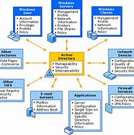

# [What is Active Directory?](https://www.cyberark.com/what-is/active-directory/)

1. **What exactly is "Active Directory" and are the key services it provides?**
   > "Active Directory (AD) is Microsoft’s directory and identity management service for Windows domain networks... AD is made up of a number of different directory services, including: Active Directory Domain Services (AD DS), Active Directory Lightweight Directory Services (AD LDS), Active Directory Certificate Services (AD CS), Active Directory Federation Services (AD FS), and Active Directory Rights Management Services (AD RMS)." - CyberArk

2. **What are the differences between a domain, forest, and tree in Active Directory?**
   > "A domain is a collection of objects (e.g., users, devices) that share the same Active Directory database... A tree is a collection of one or more domains with a contiguous namespace... A forest is a collection of one or more trees that share a common schema, global catalog, and directory configuration—but aren’t part of a contiguous namespace." - CyberArk

3. **How can objects (e.g., users, devices) within a domain be grouped?**
   > "Objects within a domain can be grouped into organizational units (OUs) to simplify administration and policy management... OUs also make it easier to delegate control over resources to various administrators." - CyberArk
4. **Explain the benefits of Active Directory, as you would to a family member.**
   > "Active Directory helps businesses improve security by controlling access to network resources... It allows companies to easily organize their data... Administrators can centrally manage user identities and access privileges... It supports redundant components and data replication for high availability and business continuity." - CyberArk
